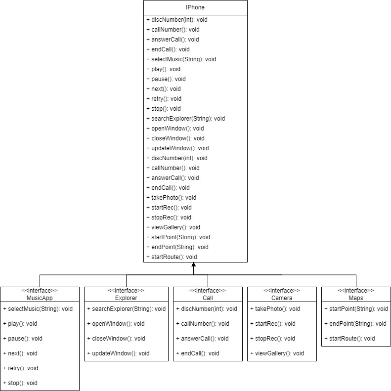

# DIO | trilha-java-basico

## Autores

- [@yuriclaro](https://www.github.com/YuriClaro)

## POO - Desafio

Modelagem e Diagramação da representação UML do IPhone apresentado pelo Steve Jobs em 2007, abrangendo suas funcionalidades como Ligações de Chamada, Camera, Navegador de Internet, Maps, e Aplicativo de música.
    

